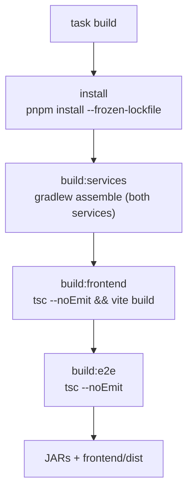
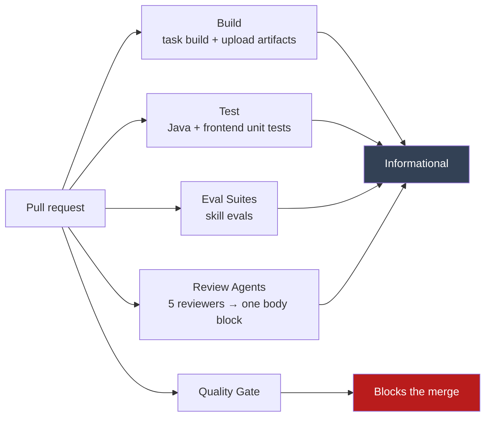
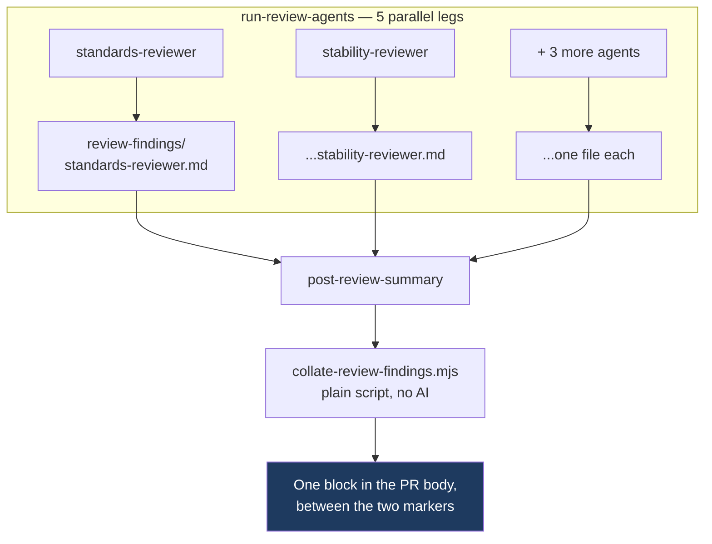
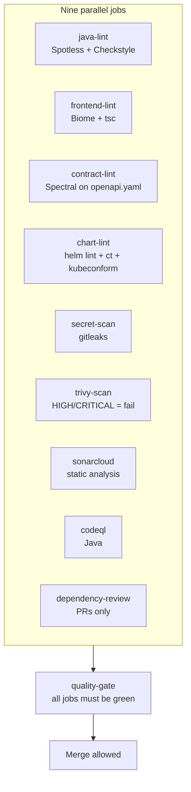
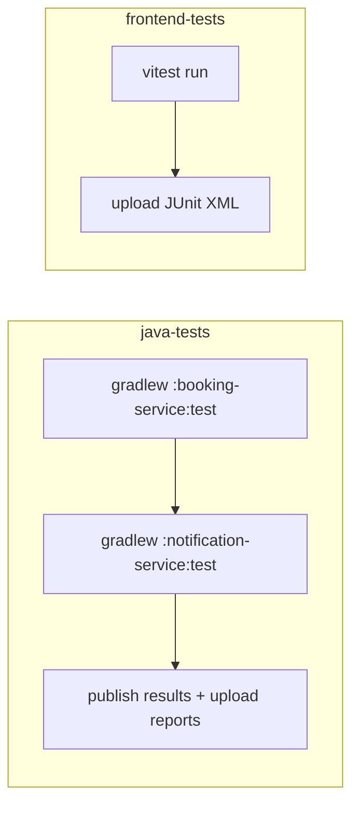
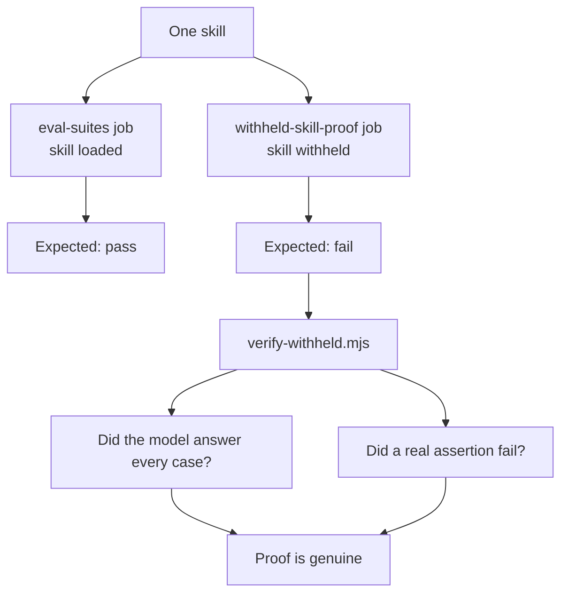

# The build process (as defined in PR #1)

This page describes what PR #1 sets up. It is a reader's guide, not a rule source.
Rules live in [`appointment-booking-project.md`](../appointment-booking-project.md); that file wins
any conflict. Reasons live in [`decisions.md`](decisions.md).

## 1. What gets built

The repository holds four buildable pieces.

| Piece | Tool | Output |
|---|---|---|
| `services/booking-service` | Gradle + Spring Boot | a JAR |
| `services/notification-service` | Gradle + Spring Boot | a JAR |
| `frontend` | pnpm + Vite | static files in `dist/` |
| `e2e` | pnpm + TypeScript | nothing; it is only type-checked |

## 2. One command builds everything

`task build` is the single documented build command (NFR-007). It runs the steps in order, and it
installs dependencies first so a clean clone works.



The steps are sequential on purpose. Nothing runs in parallel, so the result is the same every time.

On Windows, Task cannot call `./gradlew`. Run `gradlew.bat` directly, or run Task from WSL.

## 3. Pinned versions

The build pins its toolchain so every machine produces the same result.

- Java 25 (Zulu), toolchain-enforced
- Gradle 9.8.0 via the wrapper
- Spring Boot 4.1.1, applied as a Gradle platform (no `io.spring.dependency-management`)
- Node 24, pnpm 10.34.6
- Lockfiles are committed and installs use `--frozen-lockfile`

Two Gradle settings exist for determinism (NFR-001): `org.gradle.parallel=false` and
`org.gradle.caching=false`.

Two libraries are forced past what Boot 4.1.1 manages, both by Gradle constraints in the root
`build.gradle.kts`, because the managed versions fail the dependency gate:

| Library | Managed | Forced to | Why |
|---|---|---|---|
| Tomcat embed (3 artifacts) | 11.0.24 | 11.0.26 | three critical advisories |
| `com.fasterxml.jackson.core:jackson-core` | 2.22.2 | 2.22.3 | two high advisories |
| `tools.jackson.core:jackson-core` | 3.1.5 | 3.1.7 | the same two advisories |

Each constraint is temporary, and the comment beside it says when to remove it. A constraint rather
than a version property because the Boot BOM is applied as a Gradle platform, which does not honour
`tomcat.version` and friends; Gradle resolves the higher of the platform's constraint and this one.
The Spring Boot Gradle plugin also brings in Jackson 3.x on the buildscript classpath. That classpath
has its own `jackson-core` 3.1.7 constraint; the services' `implementation` constraint cannot affect
it. `buildEnvironment` confirms the plugin classpath resolves to 3.1.7 in both services.

`.gitattributes` normalises text files to LF. CI runs on Linux, and a CRLF `gradlew` fails at the
shebang.

## 4. What runs on a pull request

Five workflows fire. Only one of them can block a merge.



The AI workflows are advisory by design. No AI step can pass or fail the build, and every review
step is `continue-on-error`. Clean runs are still recorded, because a clean run is evidence.

There are no automatic retries in any workflow (NFR-001). A red run stays red.

### How the review agents report

The five agents post no comments. Each writes a findings file, and one job collates them into a
single block in the pull request body.



Each finding is one line, capped at 15 words plus a short fix:

```text
- `BookingService.java:88` — inline Instant.now() (NFR-001) -> inject Clock
```

No preamble, no severity section, no diff quotes, and no restating of the rule — the identifier
is the explanation. That shape is stated once, in the workflow prompt; each agent file points at
it rather than carrying a copy.

Three things make the body edit safe to run on every push:

- The block sits between `<!-- review-agents:start -->` and `<!-- review-agents:end -->`, which
  `.github/pull_request_template.md` carries. The splice replaces only what lies between them, so
  text the author wrote is never overwritten.
- A re-run **revises** the block rather than adding another comment. Editing the body does not
  re-trigger the workflow: `on: pull_request` defaults to `opened`, `synchronize`, and `reopened`,
  and `edited` is not among them.
- An agent that produced no file is reported as **did not report**, never as clean. A crashed agent
  recorded as clean would be false evidence, which is the one thing NFR-012 item 2 asks this to get
  right.

Collation is a plain script, not a sixth review agent: it applies no standard and never adds,
drops, merges, or rewords a finding. `node --test .github/scripts/*.test.mjs` runs in the job before it edits
anything.

## 5. The quality gate

Nine jobs run in parallel. A tenth job, `quality-gate`, reads their results and is the one required
check for branch protection.



`quality-gate` runs with `if: always()`, so it reports even when a job above it fails. It allows one
exception: `dependency-review` is skipped on a push to `main`, because that job only runs on pull
requests.

Each of these gates must be proven to fail on a planted violation (NFR-012). Two details exist for
that reason:

- Biome runs with `--error-on-warnings`. Plain `biome ci` exits 0 on a warning, so a planted
  violation would not fail the gate.
- `ct lint` runs with `--all`, not against a diff. The gate must not depend on which files the pull
  request touched.

One dependency advisory is allow-listed: `GHSA-vfj7-8cjw-p6xm`, which has no upstream fix and is
dev-only. Everything else at high or critical still fails. The reason is a row in `decisions.md`.

## 6. Tests and coverage

The `Test` workflow runs two independent jobs.



JaCoCo is wired into both services. Every `test` task is `finalizedBy` the JaCoCo report, so running
tests always produces coverage. Only the XML report is generated, because SonarCloud reads the XML.

Coverage is published, never gated (NFR-009). There is no coverage percentage threshold anywhere in
this build. Sonar's coverage import is currently suppressed for the milestone 0 placeholder sources;
`sonar-project.properties` explains why and when to remove it.

## 7. The skill eval suites

Milestone 0 ships the standards artifacts under `.claude/`. Each skill carries an eval suite, and
each suite must be shown to fail when its skill is withheld. A suite that passes without its skill
measures the model, not the artifact.



The verifier exists because a non-zero exit proves nothing on its own. A bad model id, a missing
token, or a network fault also exits non-zero. Both jobs run as a nine-way matrix, one leg per skill,
with `fail-fast: false`.

## 8. Secrets

No secret is ever in the tree. The build reads three from CI: `SONAR_TOKEN`,
`CLAUDE_CODE_OAUTH_TOKEN`, and the built-in `GITHUB_TOKEN`. `.env.example` holds placeholders and
`.env` is git-ignored.

Every workflow declares `permissions: contents: read` at the top. A job widens that only when it
must — uploading SARIF to code scanning, or publishing a check run.

## 9. Other local commands

`Taskfile.yml` holds the rest. These are the same checks the gate runs, available before pushing.

| Command | What it does |
|---|---|
| `task build` | Build all four pieces |
| `task test` | Run all Gradle tests |
| `task lint` | Java, frontend, contract, and Helm linting |
| `task format` | Apply Spotless and Biome fixes |
| `task install` | Install Node dependencies from the lockfile |
| `task lint:helm:deps` | Resolve chart dependencies before linting charts |
